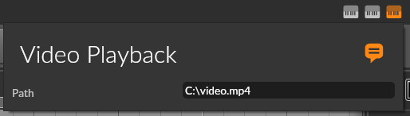

# OSC Video Stream Server for Bitwig Studio

## Installation

1. Copy the controller script ("Video Playback.control.js") into the controller scripting directory
2. In Bitwig Studio, add the Script via Settings > Controllers > Add Controller
   - Hardware Vendor: "Trinitou"
   - Script name: "Video Playback"

## Usage

1. Start the OSC Video Stream Server and open the video player website as described [here](../README.md).
2. For an open Bitwig Studio project, enter the video file path in the project-specific controller settings.

   
   - The path will be saved per project so you only have to set it up once each time.
3. Start playback in Bitwig Studio and have your video streamed to the browser in sync with Bitwig!
